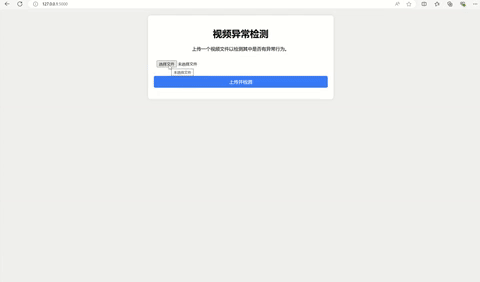

### 简易的视频异常行为检测

`python版本选用3.9`

使用方法:

首先下载模型参数数据并放入models目录下

| Benchmark   | CLIP[Baidu]                                                  | CLIP                                                         | Model[Baidu]                                                 | Model                                                        |
| ----------- | ------------------------------------------------------------ | ------------------------------------------------------------ | ------------------------------------------------------------ | ------------------------------------------------------------ |
| UCF-Crime   | [Code: 7yzp](https://pan.baidu.com/s/1OKRIxoLcxt-7RYxWpylgLQ) | [OneDrive](https://stuxidianeducn-my.sharepoint.com/:u:/g/personal/pengwu_stu_xidian_edu_cn/Ea86YOcp5z9KhRFDQm9a8zwBcGiGGg5BuBJtgmCVByazBQ?e=tqHLHt) | [Code: kq5u](https://pan.baidu.com/s/1_9bTC99FklrZRnkmYMuJQw) | [OneDrive](https://stuxidianeducn-my.sharepoint.com/:u:/g/personal/pengwu_stu_xidian_edu_cn/Eaz6sn40RmlFmjELcNHW1IkBV7C0U5OrOaHcuLFzH2S0-Q?e=x8wtVe) |
| XD-Violence | [Code: v8tw](https://pan.baidu.com/s/1q8DiYHcPJtrBQiiJMI7aJw) | [OneDrive](https://stuxidianeducn-my.sharepoint.com/:f:/g/personal/pengwu_stu_xidian_edu_cn/Et5dWQZb2cBDs7zsrp90SrQBL_52vTRNYTdjQW6SMl0ZVA?e=foX4ph) | [Code: apw6](https://pan.baidu.com/s/1O0uwVS3ZyDA1soWUv2VasQ) | [OneDrive](https://stuxidianeducn-my.sharepoint.com/:u:/g/personal/pengwu_stu_xidian_edu_cn/EYlNnn_xfVxBtQZuQgngrMsBHY-i8QHTVOs7PmryzQ2MyA?e=99nxnR) |

根据`requirement.txt`文件安装所需环境,然后运行`python app.py`

即可在网页上打开

效果演示如下:

